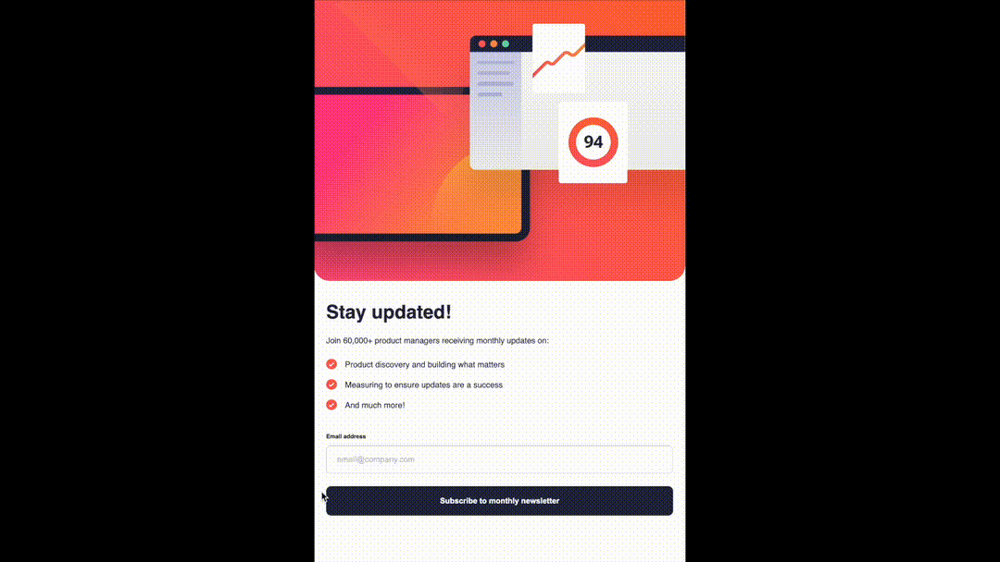

# Newsletter Sign Up With Success Message

This is my solution to the [Newsletter sign-up form with success message challenge on Frontend Mentor](https://www.frontendmentor.io/challenges/newsletter-signup-form-with-success-message-3FC1AZbNrv).

## Table of contents

- [Overview](#overview)
  - [The challenge](#the-challenge)
  - [Screenshot](#screenshot)
  - [Links](#links)
- [My process](#my-process)
  - [Built with](#built-with)
  - [What I learned](#what-i-learned)

## Overview

### The challenge

Users should be able to:

- Add their email and submit the form
- See a success message with their email after successfully submitting the form
- See form validation messages if:
  - The field is left empty
  - The email address is not formatted correctly
- View the optimal layout for the interface depending on their device's screen size
- See hover and focus states for all interactive elements on the page

### Screenshot

Here is the outcome of my solution, which is compatible with various platforms and sizes:

- Responsiveness

- Submission form ans Success page

### Links

- Solution URL: [https://github.com/rainof/newsletter-sign-up-with-success-message](https://github.com/rainof/newsletter-sign-up-with-success-message)
- Live Site URL: [https://rainof.github.io/newsletter-sign-up-with-success-message](https://rainof.github.io/newsletter-sign-up-with-success-message)

## My process

### Built with

- Semantic HTML5 markup
- CSS custom properties
- [Flexbox](https://developer.mozilla.org/en-US/docs/Learn/CSS/CSS_layout/Flexbox/)
- [CSS Grid](https://developer.mozilla.org/en-US/docs/Learn/CSS/CSS_layout/Grids)
- [Mobile-first workflow](https://developer.mozilla.org/en-US/docs/Glossary/Mobile_First)
- [ReactJS](https://reactjs.org/)

### What I learned

- Set up the project using React with a mobile-first design approach.
- Broke down components into smaller pieces and organized the file structure.
- Designed responsive layouts to transition smoothly from mobile to desktop views.
- Implemented functionality to handle form submissions, manage errors, and allow users to navigate back from the success page to the form submission page.
